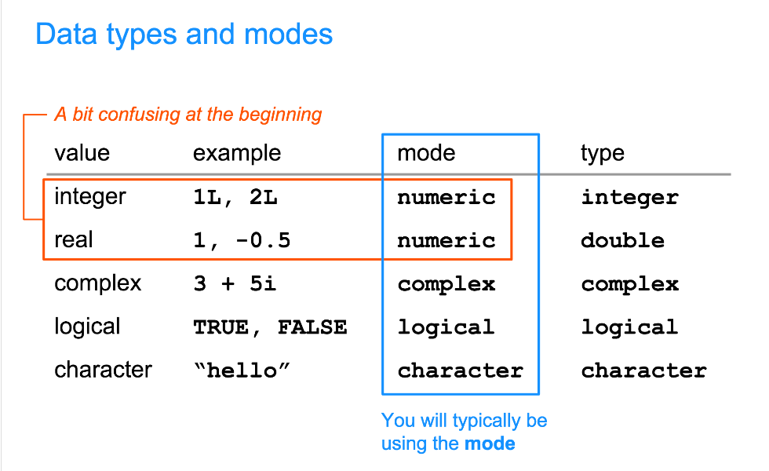

```{r setup, include=FALSE}
knitr::opts_chunk$set(echo = TRUE)
```
### Wk 1 Notes

Code results can be inserted directly into the text of a .Rmd file by enclosing the code with `r `

Parameters are useful when you want to re-render the same report with distinct values for various key inputs, for example:  
-Running a report specific to a department or geographic region.  
-Running a report that covers a specific period in time.  
-Running multiple versions of a report for distinct sets of core assumptions.  

### Data Types and Vectors in R

Common Data Types:  
- Integers (i.e. whole numbers)  
- Double (i.e. real, decimal numbers)  
- Logical (i.e. boolean)  
- Character (i.e. strings)

`typeof()` & `mode()`



Vectors : contiguous cells containing data  
- can be of any length
 - "scalars" : 1 element vector  
- vectors are atomic structures
 - the values must all be of the same type

#### Coercion

1. If a character is present, R will make everything into characters
2. If there are logicals & numbers, R will make them all numbers

```{r}
x <- c(1, 2, 3, "four", "five")
x
```

```{r}
y <- c(TRUE, FALSE, 3, 4)
y
```

Coercion Functions:  
- `as.character()`
- `as.numeric()`
- `as.integer()`
- `as.logical()`

### Bracket Notation

- to extract values from R objects use brackets
- inside the brackets, specify vector(s) of indices
- use as many indices, separated by commas, as dimensions in the object
- vectors of indices can be numbers, logicals, and sometimes characters

```{r}
x <- c(2, 4, 6, 8)
# adding names
names(x) <- letters[1:4]
x
```

```{r}
#first element
x[1]
# x[c(T, F, F, F)]
```

```{r}
#last element
x[length(x)]
```

```{r}
# use : for consecutive numbers
x[1:3]
```

```{r}
# different oder
x[c(3, 2, 4, 1)]
```

```{r}
# elements equal to 2
x[x==2]
```

```{r}
x[x>1]
```


