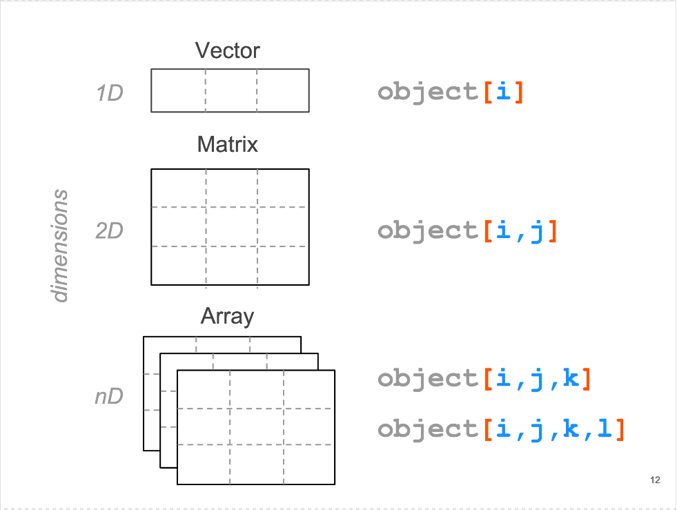
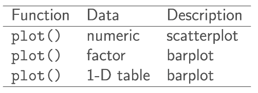
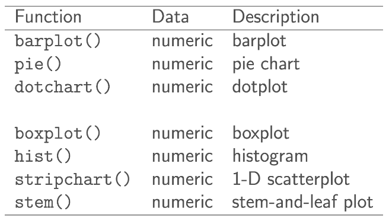
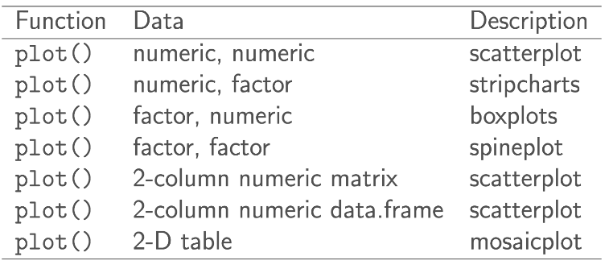
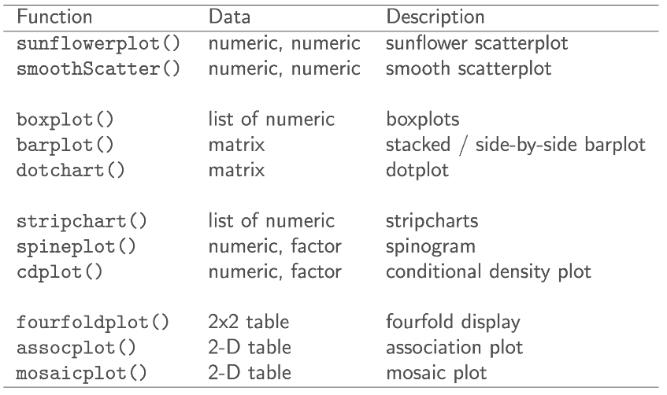
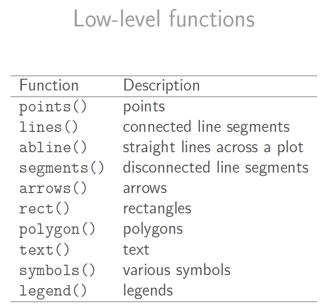

```{r setup, include=FALSE}
knitr::opts_chunk$set(echo = TRUE, comment = "")
```

## Arrays and Factos

### Matrices & Arrays

You can transform a vector into a n-dimensional array by giving it a **dimensions** attribute 
The dimensions attribute is a numeric vector with as many elements as desired dimensions

```{r}
x <- 1:8
dim(x) <- c(2,4)
# dim(x) <- c(2,2,2)
x
```

To have more control over how a matrix is filled, we use the function `matrix()`  

```{r}
a <- 1:8
A <- matrix(a, nrow = 2, ncol = 4)
A
```

About Matrices  
- R stores matrices as vectors  
 - matrices are also atoic  
- Matrices in R are stored column-major
- If you want to fill a matrix by rows, use `byrow = TRUE`

```{r}
b <- 1:8
B <- matrix(b, nrow = 2, ncol = 4, byrow = TRUE)
B
```



### Factors

A factor is designed to handle **categorical** data. (Especially data with an "ordinal" scale)  
Factors are internally stored as vectors of integers
To create a factor, pass a vector to `factor()`  

```{r}
size <- c("sm", "md", "lg", "md")
size <- factor(size)
size
```

## Lists

A list is the most general data structure in R  
Lists can contain any other type of data structure (even other lists)  
Lists are a special type of vector `lst <- vector(mode = "list")`  
Lists are vectors in the sense of being a one-dimensional object  
Lists are **not** atomic structures  


### Subsetting and Indexing

Use the bracket notation system  
use [] to extract values from a list

```{r}
lst <- list(
  c(1,2,3),
  matrix(1:9, nrow = 3, ncol = 3),
  list(1:2, c(TRUE, FALSE), c("a","b"))
)
lst
```

```{r}
#access an element
lst[3]
# access object of list element
lst[[3]]
# access objects inside the element
lst[[3]][1]
lst[[3]][[1]][1]
```


$ to access list named element(s)

list$name

```{r}
# giving names to elements in the list
lst2 <- list(
  vec = c(1,2,3),
  mat = matrix(1:9, nrow = 3, ncol = 3),
  lis = list(1:2, c(TRUE, FALSE), c("a","b"))
)
lst2
```

```{r}
lst2$vec
```

```{r}
# giving names to elements in the list
names(lst) <- c("A", "B", "C")
names(lst)
lst
```

```{r}
vec = c(1,2,3)
mat = matrix(1:9, nrow = 3, ncol = 3)
lis = list(1:2, c(TRUE, FALSE), c("a","b"))
lst3 = list(vec, mat, lis)
lst3
```

```{r}
lst4 = list(vec = vec, mat = mat, lis = lis)
lst4
```

## Graphics

- "graphics" and "grid" are the two main graphics
systems in R  
- "graphics" is the traditional system, also referred to as
base graphics  
  - high-level : functions produce complete plots  
  - low-level : functions add further output to an existing plot  
- "grid" prodives low-level functions for programming
plotting functions  

### The plot() Function

- most important high-level function   
- the 1st argument provides the data to plot  
  - the data can take diff. formsL vectors, factors, matrices, data frames  
  - one / two / multiple variables  
- you can create your own `plot()` method function

```{r}
num_vec <- (c(1:10))^2
plot(num_vec)
```

```{r}
set.seed(4)
abc <- factor(sample(c('A', 'B', 'C'), 20, replace = TRUE))
plot(abc)
```

```{r}
abc_table <- table(abc)
plot(abc_table)
```

```{r}
barplot(num_vec)
pie(1:3)
dotchart(num_vec)
```

```{r}
boxplot(num_vec)
hist(num_vec)
stripchart(num_vec)
stem(num_vec)
```

### Kernel Density Curve

We can pass a "density" object to plot() in order to get a density curve

```{r}
dens <- density(num_vec)
plot(dens)
```






```{r}
head(mtcars)
plot(mtcars$mpg, mtcars$hp, 
     xlab = "miles per gallon", ylab = "horsepower", # axis labels
     main = "Simple Scatterplot", # title
     sub = "data matcars", # subtitle
     xlim = c(10, 35), ylim = c(50,400), # x & y coordinate ranges
     cex = 1.2, # character expansion
     pch = 1:25, # point character
     col = "blue" # color
)
```

```{r}
plot(mtcars$mpg, mtcars$hp)
text(mtcars$mpg, mtcars$hp, labels = row.names(mtcars))
legend("topright", legend = "a legend")
title("Miles Per Gallon -vs- Horsepower")
```

```{r}
# simple scatter-plot
plot(mtcars$mpg, mtcars$hp, type = "n", xlab = "miles per gallon", ylab = "horsepower")
# grid lines
abline(v = seq(from = 10, to = 30, by = 5), col = gray) # vertical lines
abline(h = seq(from = 50, to = 300, by = 50), col = gray) # horizontal linesfunct
# plot points
points(mtcars$mpg, mtcars$hp, pch = 19, col = "blue")
# plot text
text(mtcars$mpg, mtcars$hp, labels = rownames(mtcars), pos = 4, col = "gray50")
# graphic title
title("Miles Per Galon -vs- Horsepower")
```

