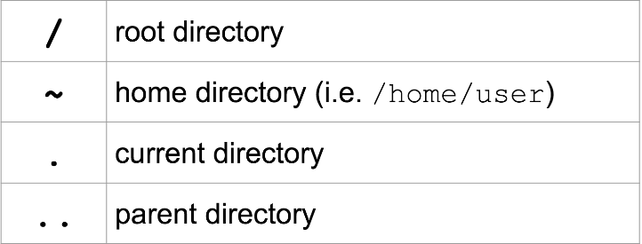
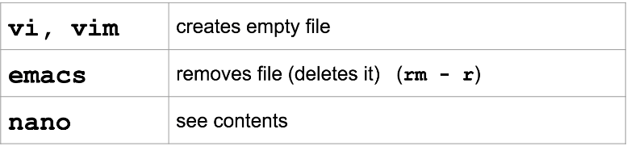
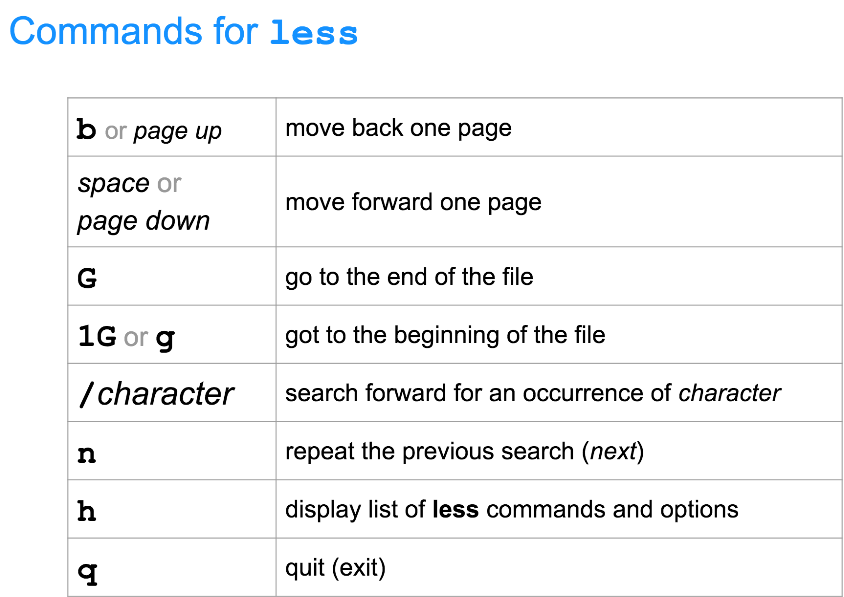
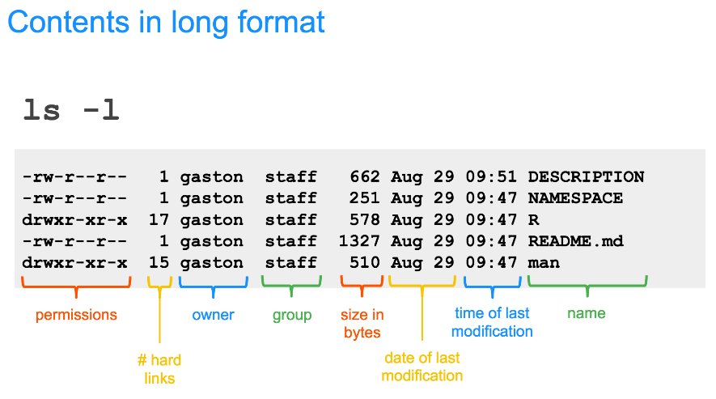
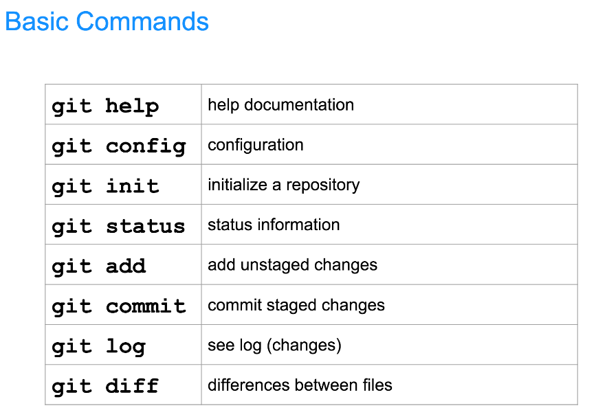

| Command        | Description                                                       |
|----------------|-------------------------------------------------------------------|
| mkdir          | create new directory                                             |
| rmdir          | remove directory
| cd             | change directory                                                  |
| curl -O        | download                                                          |
| ls             | list                                                              |
| mv             | move file's directory or change file's name                       |
| cp             | copy                                                              |
| pwd            | print working directory                                           |
| file           | obtain information about what type of file a file or directory is |
| man            | look up the manual page for a particular command                  |
| touch          | create a blank file                                               |
| rm             | delete a file                                                     |

man -k <search term>  
Do a keyword search for all manual pages containing the given search term.

/<term>  
Within a manual page, perform a search for 'term'

n  
After performing a search within a manual page, select the next found item.

Relative path  
A file or directory location relative to where we currently are in the file system. 

Absolute path  
A file or directory location in relation to the root of the file system.

